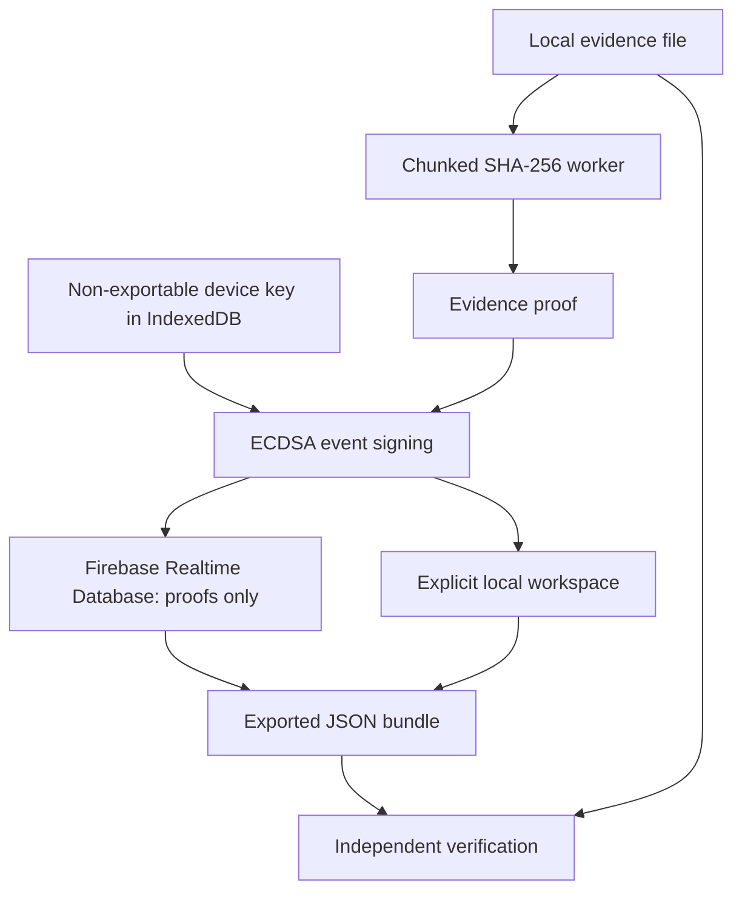

# ProofChain

**Verify evidence, not trust.**

A working local-first evidence register, exact file verifier and digitally signed custody chain. SHA-256 hashing processes complete files in 4 MB chunks inside a Web Worker. Every custody event is signed by a non-exportable ECDSA P-256 device key.

## What it proves

- A selected file has the same SHA-256 digest as a supplied evidence record.
- Signed record fields, custody links and event ordering are internally consistent.
- Each signature verifies against its actor's supplied public key.
- A supported embedded C2PA manifest passes the SDK's local validation when explicitly inspected.

It does **not** prove that a photo depicts reality, a person has a particular legal identity, no secret copies exist, a supplied history is the latest, or an unanchored device timestamp is trustworthy. Similarity never changes the exact-file verdict.

## Architecture



Frontend: React 19, strict TypeScript, Tailwind and the Next.js App Router interface served by Vinext on Cloudflare Workers/Sites. Firebase Auth and Realtime Database are external browser services, not dependencies of the hosting platform identity. No paid AI APIs, blockchain, cloud evidence storage or analytics.

### Why Realtime Database

Each record stores its mutable head and event map at one Realtime Database node. Client transactions append exactly one event and compare the expected head, while Realtime Database validation rules preserve existing event values, enforce custody transitions and prevent ordinary clients from deleting keys or records. A small per-user index makes the workspace list participant records without exposing a global query.

### Records

- `users/{uid}`: minimal account-presence record, no email directory.
- `deviceKeys/{keyId}`: immutable public JWK, account ID and algorithm. Authenticated users can read public keys; no anonymous key enumeration.
- `evidence/{id}`: immutable signed `record`, mutable custody head, event count, participants, recipient, server receipt timestamp and an `events/{eventId}` map.
- `userRecords/{uid}/{evidenceId}`: a boolean participant index used to list records for a signed-in account.

Public key fingerprints use the SHA-256 digest of canonical EC public key members (`crv`, `kty`, `x`, `y`). They are checked on import. Event signatures are Web Crypto's fixed-width P1363 ECDSA representation, Base64 encoded. The canonical payload excludes `eventHash` and `signature`; ECDSA signs it with SHA-256. `eventHash` is SHA-256 of that same canonical payload. Every event includes a digest of the entire evidence record, preventing unsigned title or description substitution.

## Run locally

Prerequisites: Node 22.13+ (Node 22.18+ recommended for native TypeScript stripping), pnpm version pinned in `package.json`. Java 17 is supported by the pinned Firebase CLI used for local rules tests; newer Firebase CLI versions require Java 21.

```bash
pnpm install
cp .env.example .env.local
pnpm dev
```

Use the local development origin printed by the server. Web Crypto requires HTTPS or a browser-trusted localhost origin. Do not weaken browser security settings to use an insecure remote origin. The managed Sites preview is HTTP-only, so it can test the interface and file-hashing worker, but it cannot perform ECDSA signing.

Production on Sites uses the repository's managed build and publication flow. The app does not need a D1 or R2 binding. `pnpm build` emits the Worker and browser assets. The bundled C2PA WASM is served locally at `/c2pa/c2pa_bg.wasm`; no CDN is required. When updating C2PA, copy the matching package's `dist/resources/c2pa_bg.wasm` to that location. Preserve its upstream license.

## Connect the supplied Firebase project

The browser configuration from the brief is centralized in `lib/firebase/client.ts`, with the same values in `.env.example`. These Firebase web identifiers are public configuration, not Admin credentials. No service account or Admin private key is present.

The supplied configuration alone does **not** grant project-management access. Live Firebase configuration was not verified and these rules have not been deployed to the user's project from this environment. The build includes the full real integration; local mode is a separate, explicitly labelled fallback.

The project owner must:

1. Open the Firebase console for `blockchainverify-33742`.
2. Enable **Authentication → Sign-in method → Google**. Email/Password is still available as an optional fallback in the account screen.
3. Create a **Realtime Database** instance if absent, then choose a locked/restricted starting mode.
4. Add the app's deployed hostname to Authentication's authorized domains if required by your project configuration.
5. From an authenticated Firebase CLI session, deploy the provided rules:

```bash
pnpm exec firebase login
pnpm exec firebase deploy --only database --project blockchainverify-33742
```

6. Sign in to the app, verify a device key appears, and use two separate accounts to register, initiate and accept a transfer. Both users should sign in once to create their account-presence record.

Do not deploy permissive test-mode rules. The app intentionally reports permission or configuration errors instead of pretending a cloud write succeeded. A timed-out write can complete later: refresh before retrying. Realtime Database transactions compare the expected head so concurrent/stale writes cannot silently fork the chain.

Firebase server rules cannot verify ECDSA or prove file possession. They enforce authorization, schema, ordering, expected digests and atomic immutable event writes. The client verifies all cryptography before displaying a valid chain or adding an event. A malicious authorized custodian can submit an invalid signature; independent verification detects it. A malicious client may attest to a publicly known file digest without possessing the file. Acceptance is a signed attestation, not a proof-of-possession protocol.

## Workflows

### Register

Select any file, wait for SHA-256, choose a non-sensitive title and optional description, and register. Filename, file contents, EXIF, GPS and previews are not saved. Image dHash storage is opt-in. Export your proof afterward, especially in local mode.

### Verify

Use an evidence ID accessible to your current workspace, or import a `.proofchain.json` bundle. Select the actual local file. Exact identity, event links, signatures and custody rules have independent results. C2PA status does not alter the file verdict. Offline bundle verification works in an already loaded secure page without querying Firebase; cold offline reload/install is not implemented.

### Transfer

A sender enters the recipient's **account ID**, copied from Account & device. No email directory is exposed, and the app sends no messages. The file travels outside ProofChain. TRANSFER does not change custody. The recipient independently hashes their copy, then signs RECEIVE only after exact match, or rejects. Incorrect digests are rejected both by the UI/state machine and by the provided Realtime Database rules.

For two local browsers/devices, the recipient first copies their LOCAL account ID. The sender signs a transfer to it and exports the updated proof. The recipient imports it on Custody transfers, selects the file, accepts and exports the receipt. Each browser stores its own snapshot; copies do not synchronize automatically. Imported local history may only extend an existing matching prefix.

### Guided demo

`/demo` creates two independent temporary device keys, a real text-file hash, a REGISTER → TRANSFER → RECEIVE chain, and altered copies. All verdicts are computed. Download the original, modified sample and generated proof to try them in `/verify`. These are isolated demo identities; no Firebase users are simulated.

### Independent command-line verification

```bash
node --experimental-strip-types scripts/verify-proof.mjs EV-example.proofchain.json original-file
# Optionally compare a previously trusted head:
node --experimental-strip-types scripts/verify-proof.mjs bundle.json original-file trusted-head-hash
```

Exit codes: 0 verified supplied proof, 1 failed check, 2 invalid input/error. This verifier does not contact Firebase or any network service. It streams file data using Node's standard crypto library.

## Tests

```bash
pnpm test
pnpm test:rules
pnpm typecheck
pnpm lint
```

`tests/crypto.test.mjs` tests known SHA-256 vectors, large chunked binary data, renamed/copy identity, byte mutations, canonical serialization, non-exportable keys, valid custody and verification events, wrong-file receipt, tampered events, forged signatures, wrong keys, missing/reordered/duplicate events, record mutation, strict malformed-bundle rejection and the documented truncation limitation.

`tests/realtime-database.test.mjs` runs against the local `demo-proofchain` Realtime Database emulator only. It tests authenticated atomic registration, unauthenticated access, participant isolation, immutable events/keys, record edits, detached events, missing head updates, valid transfer/acceptance, wrong receipt digest, impersonation, stale-head forks and participant indexing. It never writes to the user's Firebase project.

## Privacy and security limits

- Browser keys are non-exportable and stored as CryptoKey objects in IndexedDB. They are not in localStorage or Firebase. Clearing browser data loses the key. New devices get new keys; historical signatures still verify.
- Malicious JavaScript executing on the app origin can ask the key to sign. Non-exportability does not defend against XSS or a compromised client. No evidence rendering via HTML is used.
- Local mode is browser-local and user-controlled, not an append-only trusted database. Export proofs to an independent location. Firebase mode uses server-enforced client restrictions once the supplied rules are deployed.
- Database administrators bypass security rules. Interior edits fail signature/link validation. A fully replaced key directory/bundle or a truncated chain with a replaced checkpoint cannot be recognized from that bundle alone. Retain a trusted key fingerprint and independent checkpoint. There is no external transparency log or trusted timestamp authority.
- The record's time is device-reported. Firebase stores server receipt time in the mutable head, not an independently portable timestamp token.
- Embedded C2PA analysis is optional and limited to 25 MB. Remote manifest fetch and OCSP are disabled; issuer trust is explicitly not established. Absence is not evidence of fakery.
- Image metadata/dHash parsing is best-effort and capped at 20 MB. Reported image dimensions above 40 MP skip similarity. EXIF is untrusted; GPS is excluded. dHash is a 64-bit heuristic with a configurable comparison threshold, not proof of derivation.
- Verification bundles are limited to 8 MB in the UI, 5,000 events and 1,000 public keys. The workspace lists the first 100 accessible records; pagination is post-MVP.
- No service worker or installable PWA, RFC 3161 anchoring, key recovery/export, key revocation or full offline cold-start is claimed. Google sign-in is implemented through Firebase Authentication; the Google provider and authorized hostname still need to be enabled in the project console.

## Source structure

```text
app/                         Routes and shared theme
components/proofchain/       Workspace, evidence flows, custody and support screens
components/ui/               Bundled accessible primitives
lib/crypto/core.ts           Canonicalization, key fingerprints, signing, strict parsing, chain checks
lib/evidence/                Local store, hashing, metadata/C2PA, custody operations
lib/firebase/                Public configuration and transactional cloud persistence
lib/webmcp.ts                Read-only bundle-verification tool for supporting browsers
workers/evidence.worker.ts   Chunked hash-wasm SHA-256
public/c2pa/                 Locally served SDK WASM and license
scripts/verify-proof.mjs     Independent offline verifier
tests/                      Cryptographic and Realtime Database rules suites
database.rules.json         Append-only Realtime Database rules with head/event validation
.env.example                Public Firebase configuration template
```

## Design choices and references

- No blockchain: signed hash-linked records satisfy the custody use case without paid infrastructure.
- No evidence storage or analytics: less sensitive data, fewer costs and fewer operational dependencies.
- Explicit local mode provides a real cryptographic demo while live Firebase setup is outstanding. It never pretends to be authenticated cloud persistence.
- A platform-provided private deployed URL is the default handoff; sharing the hosted app with additional people requires changing its audience separately.
- RFC 8785: https://www.rfc-editor.org/rfc/rfc8785
- Realtime Database security rules: https://firebase.google.com/docs/database/security
- Official C2PA SDK: https://github.com/contentauth/c2pa-js
- hash-wasm: https://github.com/Daninet/hash-wasm

## Validation performed for this build

- 30 cryptographic/media tests passed.
- The Realtime Database emulator integration suite covers authenticated registration, participant isolation, immutable events/keys, transfer acceptance, incorrect receipts, impersonation, stale-head forks and participant indexing. Run `pnpm test:rules` after the Firebase Database emulator has been downloaded locally.
- Strict TypeScript checks and production Worker/browser build passed.
- Browser QA confirmed the dashboard and registration layout, selected-file worker processing, the exact digest against an independent system SHA-256 tool, and graceful unsupported-C2PA handling.
- Full browser signing was not tested because the managed preview is HTTP-only and does not expose Web Crypto. The same cryptographic implementation passed the Node/Web Crypto tests. Production is HTTPS; no insecure signing fallback was added.
- WebMCP registration is feature-detected; the available test browser did not expose `modelContext`, so tool-context validation was unavailable.
- A live Firebase settings probe with the supplied web API key was rejected by automatic approval review. No workaround or live project mutation was performed. Rules testing used the local demo emulator only.
